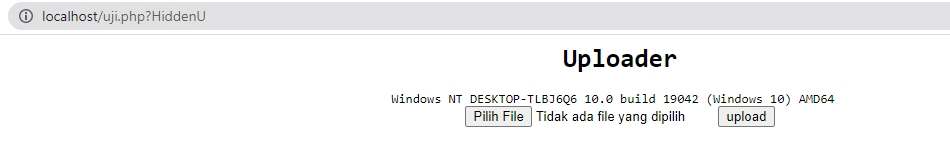

# hidden-php-shell
This Is A Simple PHP Hidden CMD and Hidden Uploader In Same Files
You Can Hide It Anywhere PHP Files You Want

Use At Own Risk

I am not responsible for all misuse of this script because this script is open source, 

it means that there are many possibilities for many irresponsible parties to misuse this script.

To Execute 

Uploader
localhost/phpfile.php?HiddenU

CMD
localhost/phpfile.php?HiddenX

ENJOY...
